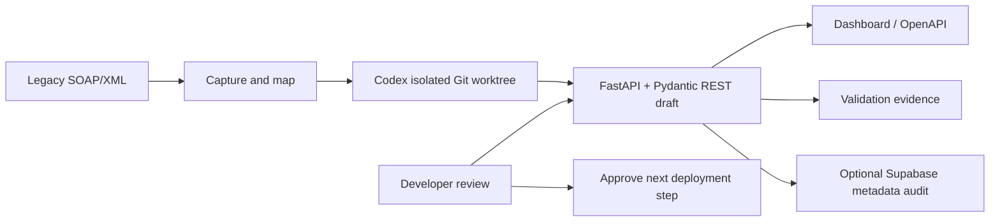

# LegacyLink

### Turn undocumented SOAP/XML integrations into reviewable REST contracts.

[](https://legacy-link-monish-007s-projects.vercel.app/dashboard)
[](https://legacy-link-monish-007s-projects.vercel.app/docs)

**Live project:** <https://legacy-link-monish-007s-projects.vercel.app/dashboard> · **Source code:** <https://github.com/monish-007/LegacyLink>

## The one-line idea

LegacyLink is a Codex-assisted modernization workspace for teams that still depend on legacy SOAP/XML systems. It discovers a candidate REST contract, generates a typed FastAPI projection, produces validation evidence, and detects sensitive fields before a developer approves release.

## Why this matters

Enterprise SOAP services are often undocumented, deeply nested, and difficult to consume from modern applications. A developer may have to manually inspect XML, infer types, write mappings, build tests, and check whether secrets accidentally appear in logs or API responses. That makes modernization slow and risky.

LegacyLink makes the workflow faster while preserving a human review boundary:

```text
Legacy SOAP/XML → contract discovery → typed REST draft → validation evidence → human review
```

## What judges can verify immediately

Open the [live dashboard](https://legacy-link-monish-007s-projects.vercel.app/dashboard), or inspect the [interactive OpenAPI docs](https://legacy-link-monish-007s-projects.vercel.app/docs).

| Capability | Evidence in the running app |
| --- | --- |
| SOAP-to-REST projection | `GET /v1/customer-data` returns strict, documented JSON |
| Validation evidence | `GET /v1/migration-report` exposes status, source fingerprint, strict types, and review status |
| Unseen XML discovery | `POST /v1/analyze-soap` infers field paths and types from a new XML payload |
| Sensitive-data awareness | Token/password/secret-like fields are flagged, while raw values are never returned |
| Trusted source workflow | `GET /v1/sources` and `POST /v1/sources/{source_id}/analyze` use server-configured sources only |
| Operational check | `GET /health` returns the service health status |

## A 60-second reviewer path

1. Open the dashboard and run **Execute GET customer data**. This shows the clean REST response produced from the legacy XML fixture.
2. Open **View validation evidence**. This shows the SHA-256 source fingerprint, validated sections, strict types, and the explicit human-approval requirement.
3. Paste the following new payload into the XML analyzer and select **Analyze contract**:

```xml
<Envelope>
  <Body>
    <Customer>
      <CustomerId>CUST-2048</CustomerId>
      <FullName>Demo Customer</FullName>
      <Balance>42500.75</Balance>
      <NextReviewDate>2026-10-01</NextReviewDate>
      <AuthToken>secret-value-never-returned</AuthToken>
    </Customer>
  </Body>
</Envelope>
```

The result infers `Balance` as a decimal and `NextReviewDate` as a date, flags `AuthToken` as sensitive, and explicitly reports `raw_values_returned: false`.

## How Codex is part of the product

Codex is used as the implementation engine in the modernization loop, not merely as a chat assistant:

1. The local legacy server provides a deterministic SOAP/XML response.
2. The orchestrator captures the contract and works in an isolated Git worktree.
3. Codex generates and refines the FastAPI routes, Pydantic models, XML mapper, tests, dashboard, and documentation.
4. The developer reviews the diff and test output before deployment.

This makes generated work inspectable and reversible. LegacyLink deliberately does not autonomously deploy generated code to production.

## Design strengths

- **Faster migration:** reduces repetitive XML reverse-engineering and mapping work.
- **Beyond a fixed demo:** analyzes new XML payloads within bounded size and field limits.
- **Privacy-aware by default:** analysis returns paths, types, confidence, and sensitivity metadata—not source values.
- **Strict contracts:** Pydantic validation covers structured dates, decimals, enums, and required fields.
- **Evidence over trust:** source hashing, validation summaries, and automated tests make the generated result reviewable.
- **Server-side source controls:** arbitrary browser URLs are rejected; configured sources and credentials stay on the server.
- **Audit-ready:** optional Supabase storage records analysis metadata only, never raw XML or authentication headers.
- **Practical adoption path:** modernizes an existing integration without requiring an immediate replacement of the legacy system.

## Architecture



## API surface

| Method | Endpoint | Purpose |
| --- | --- | --- |
| `GET` | `/health` | Health check |
| `GET` | `/v1/customer-data` | Validated JSON projection of the legacy record |
| `GET` | `/v1/migration-report` | Validation and source-fingerprint evidence |
| `POST` | `/v1/analyze-soap` | Analyze a supplied XML payload in memory |
| `GET` | `/v1/sources` | List safe metadata for configured sources |
| `POST` | `/v1/sources/{source_id}/analyze` | Fetch and analyze an allowlisted source |
| `GET` | `/dashboard` | Human-friendly review UI |

## Run locally

```powershell
python -m venv .venv
.\.venv\Scripts\Activate.ps1
pip install -r requirements.txt
python -m uvicorn app.main:app --reload
```

Open <http://127.0.0.1:8000/dashboard> or <http://127.0.0.1:8000/docs>.

Run the test suite:

```powershell
pip install -r requirements-dev.txt
python -m pytest
```

## Optional Supabase audit

Run [`supabase/migrations/001_migration_runs.sql`](supabase/migrations/001_migration_runs.sql) in the Supabase SQL Editor, then configure these backend-only variables:

```text
SUPABASE_URL=https://your-project.supabase.co
SUPABASE_SECRET_KEY=sb_secret_...
```

Only safe analysis metadata is written. Never commit the secret key, expose it in frontend JavaScript, or send it to a browser.

## Configure a real SOAP source

Sources are allowlisted through server environment configuration; clients cannot submit arbitrary URLs:

```text
LEGACYLINK_SOURCES_JSON=[{"id":"partner-bank","url":"https://example.com/soap/customer","method":"POST"}]
```

Keep authentication headers and SOAP bodies in separate backend environment variables. See [`.env.example`](.env.example). HTTPS is required for deployed sources; HTTP is intended only for explicitly enabled local demos.

## Technology

OpenAI Codex · Python · FastAPI · Pydantic · XML/SOAP · Supabase Postgres · Vercel

## Repository map

```text
app/                    FastAPI app, models, mapper, analyzer, source service
api/index.py            Vercel serverless entrypoint
tests/                  Mapping, validation, and safety tests
supabase/migrations/    Metadata-only audit table
orchestrator.py         Codex isolated-worktree workflow
legacy_server.py        Deterministic local SOAP fixture
dashboard.html          Reviewer dashboard
```

## Honest prototype boundary

LegacyLink is a hackathon prototype focused on trustworthy migration assistance. A production rollout would add enterprise secret management, authenticated source connectors, SOAP fault/retry policies, role-based approvals, encrypted audit retention, and organization-level access controls.

## Project outcome

LegacyLink turns legacy integration modernization from manual reverse-engineering into a measurable, reviewable workflow: **discover the contract, generate the REST draft, prove what was validated, protect sensitive fields, and let a human approve the next step.**
