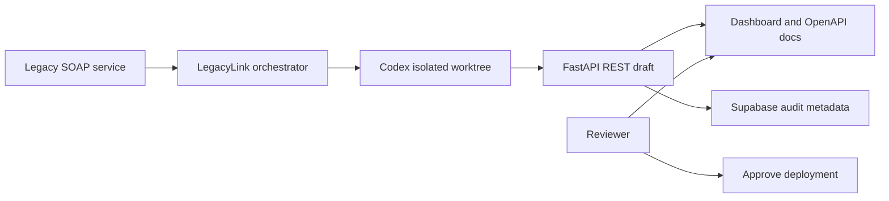

# LegacyLink

> Codex-assisted SOAP-to-REST modernization with strict contracts, validation evidence, and privacy-aware XML discovery.

[Live demo](https://legacy-link-monish-007s-projects.vercel.app/dashboard) · [API docs](https://legacy-link-monish-007s-projects.vercel.app/docs)

## The problem

Many enterprise systems still expose deeply nested, undocumented SOAP/XML services.
Modern teams must manually reverse-engineer those payloads before they can build a
safe REST integration—often with sensitive data and no reliable schema.

## The solution

LegacyLink turns a SOAP response into a reviewable FastAPI modernization draft.
Codex accelerates implementation in an isolated Git worktree; LegacyLink adds the
controls needed to inspect the result before deployment:

- Strict Pydantic API contracts for dates, decimals, enums, and required fields.
- XML validation with positive and negative tests.
- A validation report with source fingerprinting and mapping evidence.
- In-memory analysis of unseen SOAP payloads that flags sensitive field names and
  returns metadata only—not raw XML values.
- Optional Supabase audit records for safe analysis metadata.
- A human review boundary rather than autonomous production deployment.

## Architecture



## What you can try

Open the [dashboard](https://legacy-link-monish-007s-projects.vercel.app/dashboard).

| Feature | What it demonstrates |
| --- | --- |
| **GET `/v1/customer-data`** | A strictly typed JSON projection of the recorded SOAP fixture. |
| **Validation evidence** | Source SHA-256, validated sections, strict types, and review status. |
| **Analyze an unseen SOAP payload** | Field/type inference with sensitive-name detection; no source values returned. |
| **Configured live source** | Optional server-side fetch from an allowlisted SOAP endpoint. |

## Quick start

```powershell
python -m venv .venv
.\.venv\Scripts\Activate.ps1
pip install -r requirements.txt
python -m uvicorn app.main:app --reload
```

Open `http://127.0.0.1:8000/dashboard` or `http://127.0.0.1:8000/docs`.

Run tests:

```powershell
pip install -r requirements-dev.txt
python -m pytest
```

## Codex workflow

The orchestration path is intentionally constrained:

1. `legacy_server.py` simulates a legacy SOAP system.
2. `orchestrator.py` captures its XML response.
3. Codex works in a separate Git worktree and generates a reviewable API draft,
   tests, and dashboard.
4. A developer reviews the diff and test output before deployment.

This repository includes a recorded fixture for a deterministic demo. It does not
claim to autonomously deploy generated code to production.

## Supabase audit storage

LegacyLink can store only safe analysis metadata—never raw XML, request credentials,
or SOAP authentication headers.

1. Run [supabase/migrations/001_migration_runs.sql](supabase/migrations/001_migration_runs.sql)
   in the Supabase SQL Editor.
2. Set these backend-only environment variables:

```text
SUPABASE_URL=https://your-project.supabase.co
SUPABASE_SECRET_KEY=sb_secret_...
```

The secret key must never be committed, sent to the browser, or placed in frontend
JavaScript.

## Configuring a real SOAP source

Only server-configured sources can be fetched; the browser cannot submit arbitrary
URLs. Configure allowlisted source metadata with:

```text
LEGACYLINK_SOURCES_JSON=[{"id":"partner-bank","url":"https://example.com/soap/customer","method":"POST"}]
```

For authenticated sources, keep headers and SOAP request bodies in separate backend
environment variables and reference them by name. See [.env.example](.env.example).

## Deployment

The demo is deployed on Vercel. Vercel routes the public dashboard and API URLs to
the FastAPI serverless function in `api/index.py`.

Required Vercel environment variables:

```text
SUPABASE_URL
SUPABASE_SECRET_KEY
```

## Technology

- OpenAI Codex
- Python, FastAPI, Pydantic
- XML / SOAP contract mapping
- Supabase Postgres
- Vercel serverless deployment

## Repository structure

```text
app/                    FastAPI application, mapper, models, and source service
api/index.py            Vercel function entrypoint
tests/                  XML mapping and safety tests
supabase/migrations/    Audit-table schema
orchestrator.py         Codex worktree workflow
legacy_server.py        Local SOAP demo server
```

## Scope and next steps

LegacyLink is a hackathon prototype focused on a trustworthy modernization workflow.
A production rollout would add source authentication, role-based access, encrypted
secret management, SOAP fault handling, approval workflows, and organization-level
audit retention.
