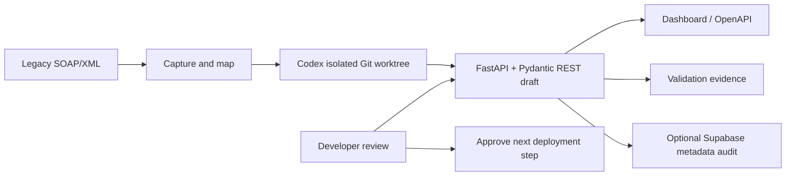

# LegacyLink

### A controlled workflow for modernising legacy SOAP/XML integrations

[](https://legacy-link-monish-007s-projects.vercel.app/dashboard)
[](https://legacy-link-monish-007s-projects.vercel.app/docs)

**Live project:** <https://legacy-link-monish-007s-projects.vercel.app/dashboard> · **Source code:** <https://github.com/monish-007/LegacyLink>

## 1. Project Overview

LegacyLink is a Codex-assisted service for analysing legacy SOAP/XML integrations and preparing a typed REST representation. The system identifies fields and candidate types, generates a FastAPI projection, produces validation evidence, and identifies sensitive fields before release approval.

## 2. Problem Statement

Enterprise SOAP services are frequently undocumented, deeply nested, and difficult to consume from modern applications. Modernisation therefore requires manual XML inspection, type inference, field mapping, test creation, and protection of sensitive values. These activities increase implementation time and the risk of contract or data-handling errors.

LegacyLink provides the following controlled workflow:

```text
Legacy SOAP/XML → contract discovery → typed REST draft → validation evidence → human review
```

## 3. Functional Capabilities

The deployed [dashboard](https://legacy-link-monish-007s-projects.vercel.app/dashboard) and [OpenAPI documentation](https://legacy-link-monish-007s-projects.vercel.app/docs) provide access to the implemented capabilities.

| Capability | Evidence in the running app |
| --- | --- |
| SOAP-to-REST projection | `GET /v1/customer-data` returns strict, documented JSON |
| Validation evidence | `GET /v1/migration-report` exposes status, source fingerprint, strict types, and review status |
| Unseen XML discovery | `POST /v1/analyze-soap` infers field paths and types from a new XML payload |
| Sensitive-data awareness | Token/password/secret-like fields are flagged, while raw values are never returned |
| Trusted source workflow | `GET /v1/sources` and `POST /v1/sources/{source_id}/analyze` use server-configured sources only |
| Operational check | `GET /health` returns the service health status |

## 4. Demonstration Procedure

The deployed dashboard supports the following verification procedure:

1. Run **Execute GET customer data** to view the strictly typed REST response produced from the legacy XML fixture.
2. Open **View validation evidence** to inspect the SHA-256 source fingerprint, validated sections, strict types, and explicit human-approval requirement.
3. Submit a new XML payload to the analyzer to generate a candidate contract:

```xml
<Envelope>
  <Body>
    <Customer>
      <CustomerId>CUST-2048</CustomerId>
      <FullName>Demo Customer</FullName>
      <Balance>42500.75</Balance>
      <NextReviewDate>2026-10-01</NextReviewDate>
      <AuthToken>secret-value-never-returned</AuthToken>
    </Customer>
  </Body>
</Envelope>
```

The result infers `Balance` as a decimal and `NextReviewDate` as a date, flags `AuthToken` as sensitive, and explicitly reports `raw_values_returned: false`.

## 5. Codex Development Workflow

Codex is used as the implementation engine for the modernisation workflow:

1. The local legacy server provides a deterministic SOAP/XML response.
2. The orchestrator captures the contract and works in an isolated Git worktree.
3. Codex generates and refines the FastAPI routes, Pydantic models, XML mapper, tests, dashboard, and documentation.
4. The developer reviews the diff and test output before deployment.

Generated changes remain inspectable and reversible. Production deployment remains subject to developer review and approval.

## 6. Security and Governance Properties

- **Bounded analysis:** new XML payloads are processed within defined size and field limits.
- **Privacy-preserving output:** analysis returns paths, types, confidence, and sensitivity metadata; source values are not returned.
- **Strict contracts:** Pydantic validation covers dates, decimals, enumerations, and required fields.
- **Validation evidence:** source hashing, validation summaries, and automated tests support review of generated results.
- **Server-side source controls:** clients cannot submit arbitrary URLs; configured sources and credentials remain on the server.
- **Metadata-only audit:** optional Supabase integration stores analysis metadata and excludes raw XML and authentication headers.
- **Incremental adoption:** the REST projection can be introduced while the legacy service remains operational.

## 7. System Architecture



## 8. API Reference

| Method | Endpoint | Purpose |
| --- | --- | --- |
| `GET` | `/health` | Health check |
| `GET` | `/v1/customer-data` | Validated JSON projection of the legacy record |
| `GET` | `/v1/migration-report` | Validation and source-fingerprint evidence |
| `POST` | `/v1/analyze-soap` | Analyze a supplied XML payload in memory |
| `GET` | `/v1/sources` | List safe metadata for configured sources |
| `POST` | `/v1/sources/{source_id}/analyze` | Fetch and analyze an allowlisted source |
| `GET` | `/dashboard` | Human-friendly review UI |

## 9. Local Development

```powershell
python -m venv .venv
.\.venv\Scripts\Activate.ps1
pip install -r requirements.txt
python -m uvicorn app.main:app --reload
```

Open <http://127.0.0.1:8000/dashboard> or <http://127.0.0.1:8000/docs>.

Run the test suite:

```powershell
pip install -r requirements-dev.txt
python -m pytest
```

## 10. Supabase Audit Integration

Run [`supabase/migrations/001_migration_runs.sql`](supabase/migrations/001_migration_runs.sql) in the Supabase SQL Editor, then configure these backend-only variables:

```text
SUPABASE_URL=https://your-project.supabase.co
SUPABASE_SECRET_KEY=sb_secret_...
```

Only safe analysis metadata is written. Never commit the secret key, expose it in frontend JavaScript, or send it to a browser.

## 11. Source Configuration

Sources are allowlisted through server environment configuration; clients cannot submit arbitrary URLs:

```text
LEGACYLINK_SOURCES_JSON=[{"id":"partner-bank","url":"https://example.com/soap/customer","method":"POST"}]
```

Keep authentication headers and SOAP bodies in separate backend environment variables. See [`.env.example`](.env.example). HTTPS is required for deployed sources; HTTP is intended only for explicitly enabled local demos.

## 12. Technology Stack

OpenAI Codex · Python · FastAPI · Pydantic · XML/SOAP · Supabase Postgres · Vercel

## 13. Repository Structure

```text
app/                    FastAPI app, models, mapper, analyzer, source service
api/index.py            Vercel serverless entrypoint
tests/                  Mapping, validation, and safety tests
supabase/migrations/    Metadata-only audit table
orchestrator.py         Codex isolated-worktree workflow
legacy_server.py        Deterministic local SOAP fixture
dashboard.html          Reviewer dashboard
```

## 14. Scope and Production Considerations

LegacyLink is a prototype for migration assistance. A production implementation would require enterprise secret management, authenticated source connectors, SOAP fault and retry policies, role-based approvals, encrypted audit retention, and organisation-level access controls.

## 15. Summary

LegacyLink provides a measurable and reviewable path from legacy SOAP/XML contracts to typed REST interfaces. The system combines contract discovery, generated mappings, validation evidence, sensitive-field detection, and human approval within one workflow.
